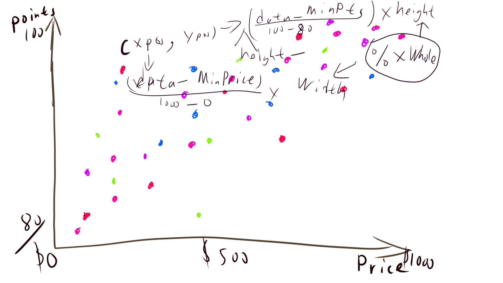

# HW05
The dataset that I choosed was the Wine Dataset... I choosed it for two reasons: first, I am researching about wine recently as a personal intrest, so this data set is interesting for me; reason II, this data is one of the only sets that do not have a time parameter, I just feel like if data set have a time factor you have to do it a certain way? So I kind of do not want to do that.

I chose the parameter: Points-> y axis; Price-> x axis, and country-> color. I chose this to maker a graph that was similar to a scatter diagram to study the relationship between the pirce of wine and the points it gets. I was only studying on wine $0-200 because this covers 7691/7729 of the data base because almost all wines falls between $0-150, if I include the real highest price, the low-price part will be all overlapping together. This is also the reason why I shift the points of different countries a little away from their original yPos as to avoid overlapping.

Generally, how to read this graph is: first the y axis is the points from 80(the lowest point) to 100 (because this is the main thing that I want to study), the x axis is the price, and the color is the production country of the wine. The first country is Argentina, the color I used for it is deep blue. The second country is Australia, the color is purple. The third country is France, the color is deep red. The fourth country is Italy, the color is a shade of green. The fifth country is Spain, the color is golden or orangish-yellow. The sixth country is the US, the color is navy blue. I kind of get the color from the nation flags of those countries. And also I made all the color half transparent, because then you can use the color deepness of the dots to know where on the graph do more wine fall into. So basically, you can see from the graph, there is a positive relationship between price and points between price $0-100 and after $100 the relationship is not that obvious; we can also found that most wines falls in price 0-75 and points 85-95; and we can also see that compare to other countries, wines from the US have the biggest price variations (difference)...

Image on repo:  

